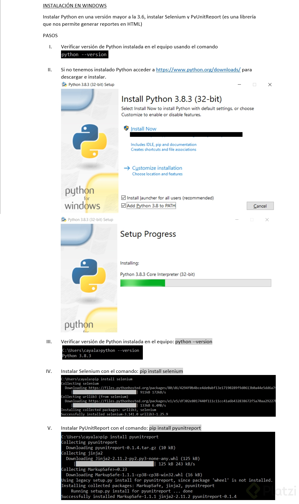

# Desarrollo Test 


# Instalación de dependencias 

## Selenium

## Instalar Python




## Instalar Library de Testing
```
pip install selenium
pip pyunitreport
```
## Driver

se debe cambiar la ruta del webDriver dentro del programa, en donde se encuentre

```
cls.driver = webdriver.Chrome(executable_path=r'C:\Users\guill\Desktop\selenium\Driver\chromedriver.exe')
```

## Ejecución en consola
```
python nombreProyecto.py
```

## RSpec

Para instalar la gema rspect se debe agregar en el archivo Gemfile.rb del proyecto desarrollado en RoR de la siguiente forma:

```
group :development, :test do
# Call 'byebug' anywhere in the code to stop execution and get a debugger console
  gem 'byebug', platforms: [:mri, :mingw, :x64_mingw]
  gem 'rspec-rails', '~> 3.5'
end

group :test do
  gem 'factory_bot_rails'
  gem 'shoulda-matchers'
  gem 'faker'
  gem 'database_cleaner'
end
```

Posteriormente se debe ejecutar el siguiente comando para actualizar las gemas del proyecto:

```
$ bundle install
```

Esta gema al tener un comportamiento especial debe ser instalada de forma individual

```
$ rails generate rspec:install
```

Para ejecutar la sección de test se ejecuta por medio del siguiente código:

```
$ bundle exec rspec
```

Las siguientes lineas de codigo deben ser agregados en el archivo creado anteriormente rails_helpers.rb para instalar gemas como shoulda-matchers.

```
# Line 8 Add additional requies below ...
Shoulda::Matchers.configure do |config|
  config.integrate do |with|
    with.test_framework :rspec

    # Keep as many of these lines as are necessary:
    with.library :active_record
    with.library :active_model
    with.library :action_controller
    with.library :rails
  end
end
```

```
Dentro de RSpec.configure do |config|, agregar

  config.include FactoryBot::Syntax::Methods

  config.before(:suite) do
      DatabaseCleaner.strategy = :transaction
      DatabaseCleaner.clean_with(:truncation)
  end

  config.around(:each) do |example|
    DatabaseCleaner.cleaning do
      example.run
    end
  end
```